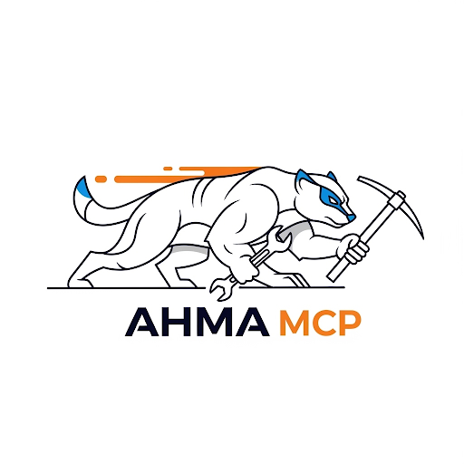

# Ahma MCP

_Create agents from your command line tools with one JSON file, then watch them complete your work faster with **true multi-threaded tool-use agentic AI workflows**._

| | |
| --- | ---: |
| [](https://github.com/paulirotta/ahma_mcp/actions/workflows/build.yml) [](https://paulirotta.github.io/ahma_mcp/html/) [](https://opensource.org/licenses/MIT) [](https://www.apache.org/licenses/LICENSE-2.0) [](https://www.rust-lang.org/) |  |

`ahma_mcp` is a toolbox for safely wrapping command line tools for AI use. This is done by creating (use AI) a ´.ahma/tools/somenewtool.json´.

"Ahma" is Finnish for wolverine. An ahama is fast and fearless, able to eat just about anything. Use the existing tools or add a PR for new ones you crate.

This project is actively used and still undergoing rapid evolution. http MCP is still a work in progress, setup isn't as smooth as we like yet and expect breaking changes including CLI parameters.

We adapt concepts from [Requirements Engineering](https://en.wikipedia.org/wiki/Requirements_engineering), Test Driven Development (TDD) and AI coding tools into `requirements.md`

## Key Features

- **Sandboxed Execution**: Strict path validation prevents accessing files outside the workspace.
- **Synchronous By Default with Async Support**: Synchronous operations use less context so prefer them for short operations. Command line `--async` allows the LLM continue work and receive the results when ready. Supports for multiple concurrent long-running operations (builds, tests).
- **Easy Tool Definition**: Add any command-line tool to your AI's arsenal by creating a single JSON file. No recompilation needed.
- **Sequence Tools**: Chain multiple commands into a single, powerful workflow (e.g., `cargo_qualitycheck` runs format → lint → test → build).

## Security Sandbox

Ahma MCP implements **kernel-level sandboxing** to protect your system. The sandbox scope is set once at server startup and cannot be changed during the session—the AI has full access within the sandbox but zero access outside it.

### Sandbox Scope

The sandbox scope defines the root directory boundary for all file system operations:

- **STDIO mode**: Defaults to the current working directory when the server starts
- **HTTP mode**: Set once by the client at session initialization (cannot be changed during session)
- **Override**: Use `--sandbox-scope <path>` command-line parameter to force a specific sandbox scope

### Platform-Specific Enforcement

#### Linux (Landlock)

On Linux (kernel 5.13+), Ahma uses [Landlock](https://docs.kernel.org/userspace-api/landlock.html) for kernel-level file system sandboxing. No additional installation is required—Landlock is built into modern Linux kernels.

**Requirements**: Linux kernel 5.13 or newer. If your kernel is older, the server will refuse to start and display upgrade instructions.

#### macOS (Bubblewrap)

On macOS, Ahma uses [Bubblewrap](https://github.com/containers/bubblewrap) to sandbox all command execution.

**Installation**:

```bash
brew install bubblewrap
```

If Bubblewrap is not installed, the server will refuse to start and display installation instructions.

### Why Kernel-Level Sandboxing?

Previous approaches that parsed command-line strings for dangerous patterns are fundamentally insufficient for security. AI models can easily construct commands that bypass string-based checks. Kernel-level enforcement provides a hard security boundary that cannot be circumvented by clever command construction.

**Security Model**: "AI can do whatever it likes inside the sandbox—it has no access outside the sandbox."

### Example async tool use: AI-driven workflow

Synchronous is simpler when the turns are fast. Async can be helpful for long-running tool calls.

Here's an example of Claude Sonnet 4.5's workflow. Notice both the tool and the AI are working at the same time:

> Now let me run the tests again using the MCP server:
>
> _Ran cargo_test ahma_mcp (MCP Server)_
>
> While the tests run, let me continue with updating the requirements document:
>
> _Read requirements.md_
>
> Let me add the JSON schema requirements to the product requirements:
>
> _requirements.md+21-6_
>
> Now let me check on the test results:
>
> _Ran status ahma_mcp (MCP Server)_
>
> I can see the issue...

## Getting Started

### Project Structure

`ahma_mcp` is organized as a Cargo workspace with several crates:

- **`ahma_core`**: Library crate containing all core functionality (tool execution, configuration, async orchestration, MCP service)
- **`ahma_shell`**: Binary crate providing the CLI interface and server startup logic
- **`ahma_validate`**: Binary crate for validating tool configuration files against the MTDF schema
- **`ahma_list_tools`**: Binary crate to dump all MCP tool information from an MCP server (stdio or HTTP) to the terminal for testing and development

This modular architecture ensures clean separation of concerns and enables future extensions (e.g., web interface, authentication).

### Installation

1. **Clone and build the repository**:

    ```bash
    git clone https://github.com/paulirotta/ahma_mcp.git
    cd ahma_mcp
    cargo build --release
    cargo run --release -- --help
    ```

2. **Add the MCP definition**:

    In your global `mcp.json` file add the following (e.g., Mac: `~/Library/Application Support/Code/User/mcp.json` or `~/Library/Application Support/Cursor/User/mcp.json`, or Linux: `~/.config/Code/User/mcp.json` or `~/.config/Cursor/User/mcp.json`).

    Update paths as needed. `--async` in the example below is optional

    ```json
    {
        "servers": {
                "Ahma": {
                "type": "stdio",
                "cwd": "~/github/ahma_mcp/",
                "command": "~/github/ahma_mcp/target/release/ahma_mcp",
                "args": [
                    "--async",
                    "--tools-dir",
                    "~/github/ahma_mcp/.ahma/tools"
                ]
            }
        }
    }
    ```

3. **Run tests to verify installation**:

    ```bash
    cargo test
    ```

The compiled binary will be at `target/release/ahma_mcp`.

## Usage Modes

`ahma_mcp` supports three modes of operation:

### 1. STDIO Mode (Default)

Direct MCP server over stdio for integration with MCP clients:

```bash
ahma_mcp --mode stdio --tools-dir ./tools
```

### 2. HTTP Bridge Mode

HTTP server that proxies requests to the stdio MCP server:

```bash
# Start HTTP bridge on default port (3000)
ahma_mcp --mode http

# Custom port
ahma_mcp --mode http --http-port 8080 --http-host 127.0.0.1
```

Then send JSON-RPC requests to `http://localhost:3000/mcp`:

```bash
curl -X POST http://localhost:3000/mcp \
  -H "Content-Type: application/json" \
  -d '{"jsonrpc":"2.0","id":1,"method":"tools/list","params":{}}'
```

### 3. CLI Mode

Execute a single tool command:

```bash
ahma_mcp cargo_build --working-directory . -- --release
```

## VS Code MCP Integration

To use `ahma_mcp` with GitHub Copilot in VS Code:

1. **Enable MCP in VS Code Settings**:

    ```json
    "chat.mcp.enabled": true
    ```

2. **Configure the MCP Server** in your global `mcp.json` file (e.g., `~/Library/Application Support/Code/User/mcp.json` on macOS).

    ```jsonc
    {
        "servers": {
            "ahma_mcp": {
                "type": "stdio",
                "cwd": "${workspaceFolder}",
                "command": "/path/to/your/ahma_mcp/target/release/ahma_mcp", // Use absolute path
                "args": [
                    "--mode",
                    "stdio",
                    "--tools-dir",
                    "tools"
                ],
            }
        }
    }
    ```

    **Important:** Replace `/path/to/your/ahma_mcp` with the absolute path to the cloned repository.

3. **Restart VS Code** and start a chat with GitHub Copilot. You can now ask it to use `ahma_mcp` tools (e.g., "Use ahma_mcp to show the git status").

## Project Philosophy and Requirements

This project is guided by a clear set of principles and requirements.

- **`requirements.md`**: This is the **single source of truth** for the project. It details the core mission, architecture, and the workflow an AI maintainer must follow. All new tasks and changes are driven by this document.
- **`docs/CONSTITUTION.md`**: This document outlines the core development principles for human contributors, ensuring consistency and quality.

For a list of available tools and instructions on how to add your own, please refer to the `requirements.md` file and the examples in the `tools/` directory.

## Developer Scripts

- **`scripts/ahma-inspector.sh`**: Builds ahma_mcp and launches the MCP Inspector web interface (`npx @modelcontextprotocol/inspector`) for interactive debugging and testing of your tool definitions.

## Troubleshooting

- **MCP tools not working?** Ensure the `command` path in `mcp.json` is an absolute path to the compiled `ahma_mcp` binary.
- **"execution_failed" errors?** Verify file permissions (`chmod +x /path/to/binary`) and ensure you have run `cargo build --release`.
- **Operations timing out?** The default timeout is 4 minutes. Use the `status` tool to check on long-running operations.

## License

Licensed under either [Apache License 2.0](APACHE_LICENSE.txt) or [MIT License](MIT_LICENSE.txt).
